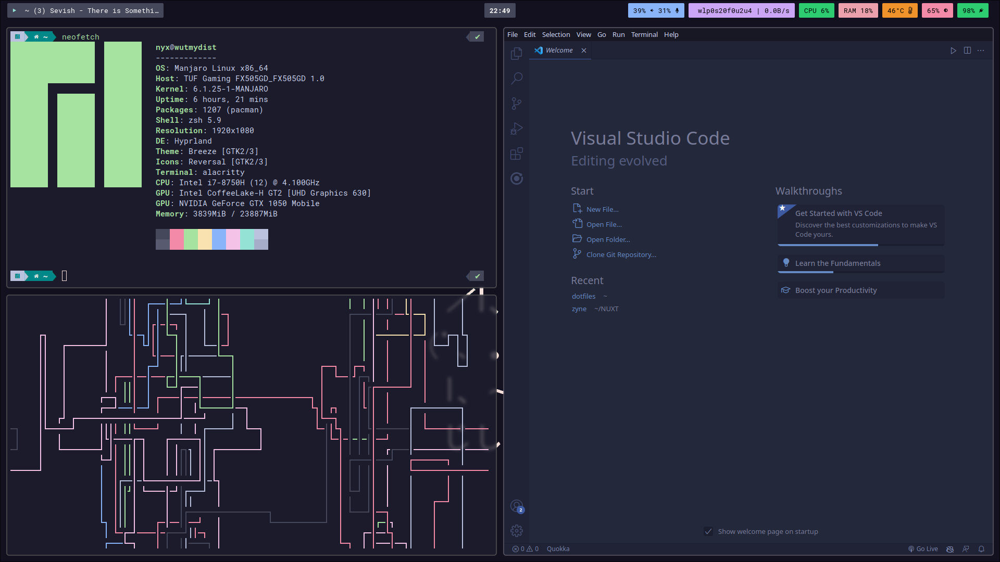

<h1 align="center">Jo's Hyprland dotfiles</h1>
<p align="center">my Hyprland dotfiles because I'm tired of manually reconfiguring them 🙃<p>

<br>
<br>




<br>
<br>

## Installation

Arch-based Linux distro installation (assuming you already have Hyprland installed):

```bash
pacman -S yay alacritty hyprpaper pipewire wireplumber grim slurp polkit-kde-agent qt5-wayland qt6-wayland waybar wofi wl-clipboard cliphist pavucontrol light playerctl exa
```

```bash
yay -S hyprpicker
```

<br>
Thunar (File Manager)

```bash
thunar thunar-archive-plugin thunar-volman ffmpegthumbnailer tumbler
```

<br>
<br>

## Setting up

Clone this repository

```bash
git clone https://github.com/jo0707/dotfiles
cd dotfiles
```

Move alacritty, hypr, waybar and wofi folder to ~/.config/

```bash
mv alacritty hypr waybar wofi -t ~/.config/
```

Move fonts to /.local/share/fonts

```bash
mkdir -p ~/.local/share/fonts
mv alacritty hypr waybar wofi -t ~/.local/share/fonts
fc-cache -f -v
```

Move wallpaper

```bash
mkdir -p ~/Pictures
mv wallpaper.png ~/Pictures/wallpaper.png
```

<b>Since the .zshrc file onvly contains a few aliases, maybe you don't want to overwrite it and just append it to your zshrc.</b> but :

```bash
mv .zshrc ~/.zshrc
```

```bash
reboot
```

<br>
<br>

#### Thats it

These dotfiles are not mature and are only intended for personal use. Cheers :)

wallpaper credit : https://github.com/Subarupan/archdotfailid
